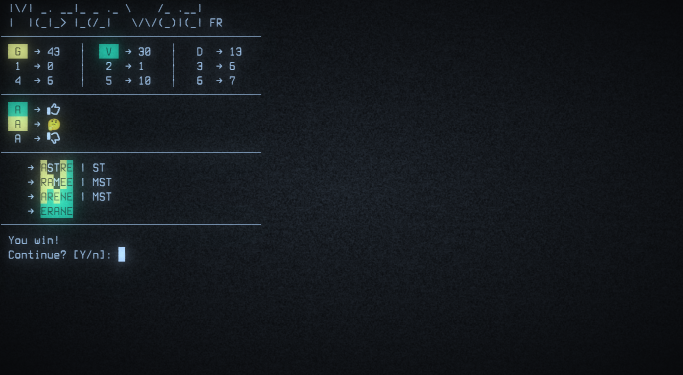

# MasterWord


**MasterWord** is a clone of Wordle written in Bash.

A list of words taken from *Le Littré* dictionary is provided for French language.  
For other languages, **MasterWord** creates a wordlist based on the default system dictionary located in `/usr/share/dict/words`.

## Dependencies

Latest version of: bash, coreutils, words.

## Install

```
> git clone https://github.com/teegre/masterword.git
> cd masterword
> sudo make install
```

## Uninstall

`sudo make uninstall`

You may also want to remove `/home/$USER/.config/masterword` directory.
